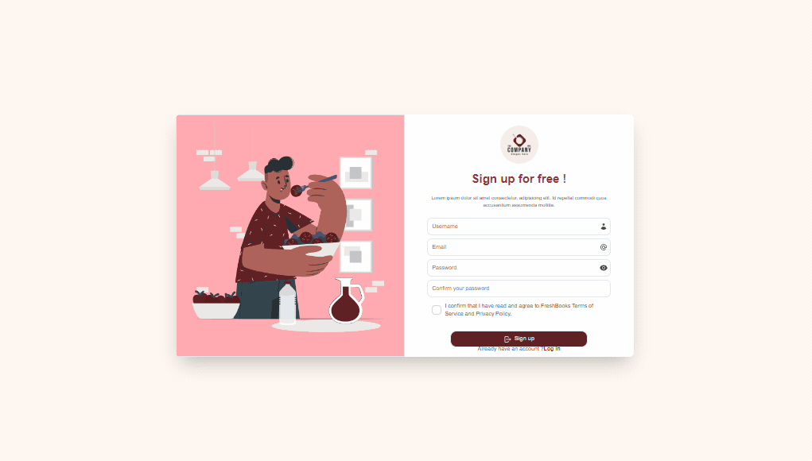

## Presentation

<br />
<p align=center ></p>
<br />

## Features

- Authentication via Google
- Add ingredient, recipes and get nutritional informations
- Like, comment and rate recipes from other users

## Development

1. Clone the repo

2. Install and run

```sh
$ npm i
$ npm run dev
```

This will run the website at http://localhost:3001.

## Stack

- Remix
- TypeScript
- Prisma / SQLite
- TailwindCSS
